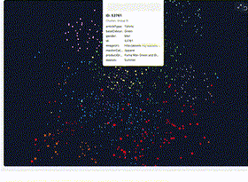
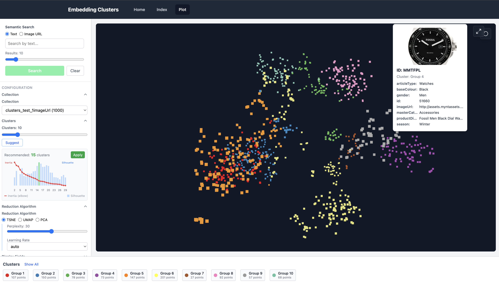
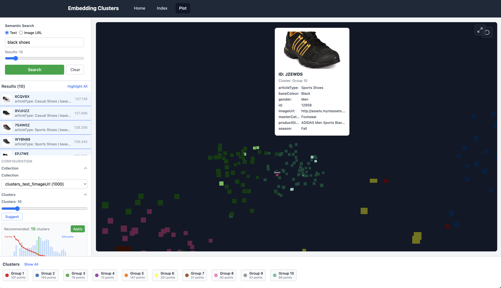
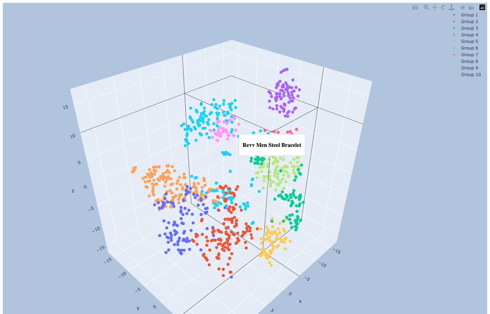
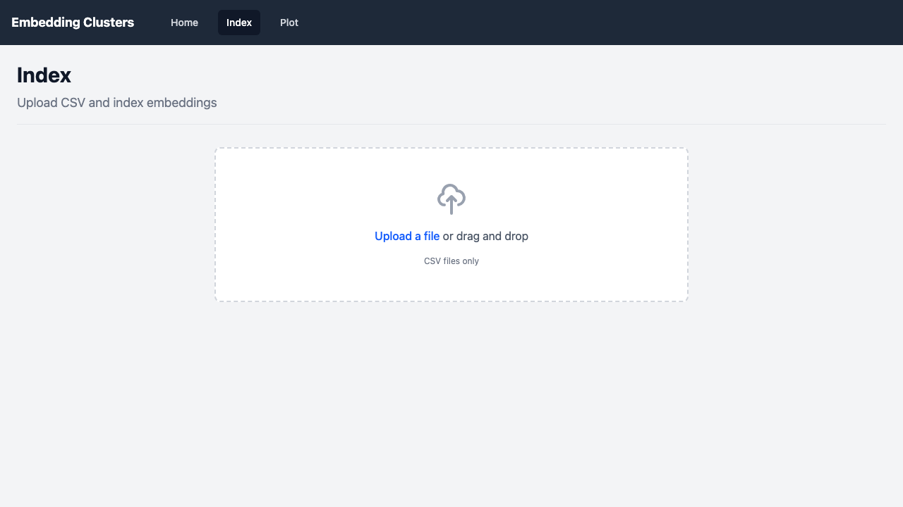
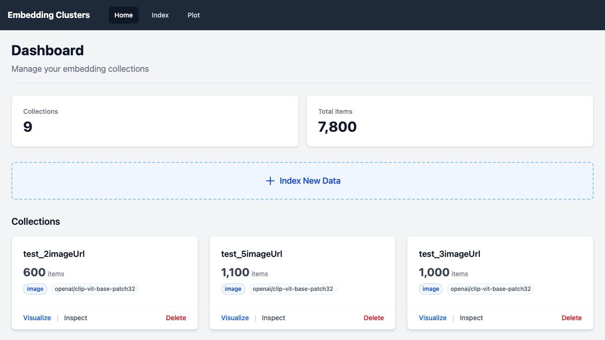

# embedding-clusters

![python-version][python-version]

Turn raw CSV data into beautiful, interactive embedding clusters with fast
semantic search and a web UI.







## Quick Start (Web UI)

```bash
git clone https://github.com/aGallea/embedding-clusters.git
cd embedding-clusters
uv sync --all-extras
RUNNING_MODE=SERVER uv run python -m embedding_cluster
```

Open <http://localhost:8000>.

Optional: index sample data if you do not see collections yet:

```bash
RUNNING_MODE=INDEX \
  LOCAL_CSV_FILENAME=./embedding_cluster/csv/fashion_small.csv \
  ID_FIELD=id \
  TEXT_EMBEDDING_FIELDS='["productDisplayName"]' \
  CHROMADB_COLLECTION_PREFIX=fashion_ \
  uv run python -m embedding_cluster
```

## Features

- **Embeddings & Storage**: CLIP (images) + SentenceTransformer (text) with
  ChromaDB persistence.
- **Clustering & Plot**: k-means clusters with 3D t-SNE, UMAP, or PCA.
- **Search & Collections**: semantic search by text or image URL, collection
  browsing and deletion.
- **Web UI**: CSV upload, live progress, plot controls, and multiple render
  modes.

## Visual Highlights






## Advanced CLI

### Index (CLI)

```bash
RUNNING_MODE=INDEX \
  LOCAL_CSV_FILENAME=./embedding_cluster/csv/fashion_small.csv \
  ID_FIELD=id \
  IMAGE_EMBEDDING_FIELDS='["imageUrl"]' \
  CHROMADB_COLLECTION_PREFIX=fashion_ \
  NUMBER_OF_ASYNC_TASKS=10 \
  uv run python -m embedding_cluster
```

### Plot (CLI)

```bash
RUNNING_MODE=PLOT \
  CHROMADB_COLLECTION_NAME=fashion_imageUrl \
  TEXT_DISPLAY_FIELDS='["productDisplayName"]' \
  IMAGE_FIELD=imageUrl \
  uv run python -m embedding_cluster
```

Key environment variables:

- `RUNNING_MODE`: `INDEX`, `PLOT`, or `SERVER`
- `TEXT_MODEL_NAME`: SentenceTransformer model name
- `IMAGE_MODEL_NAME`: CLIP model name
- `NUM_CLUSTERS`: k-means cluster count
- `REDUCTION_ALGORITHM`: `tsne`, `umap`, or `pca`

## Development

```bash
uv sync --all-extras
uv run ruff check embedding_cluster/ tests/
uv run ruff format embedding_cluster/ tests/
uv run mypy embedding_cluster/
uv run pytest
```

## Contributing

Pull requests are welcome. For major changes, please open an issue first.

<!-- MARKDOWN LINKS & IMAGES -->
[python-version]: https://img.shields.io/badge/python-3.13-blue.svg
