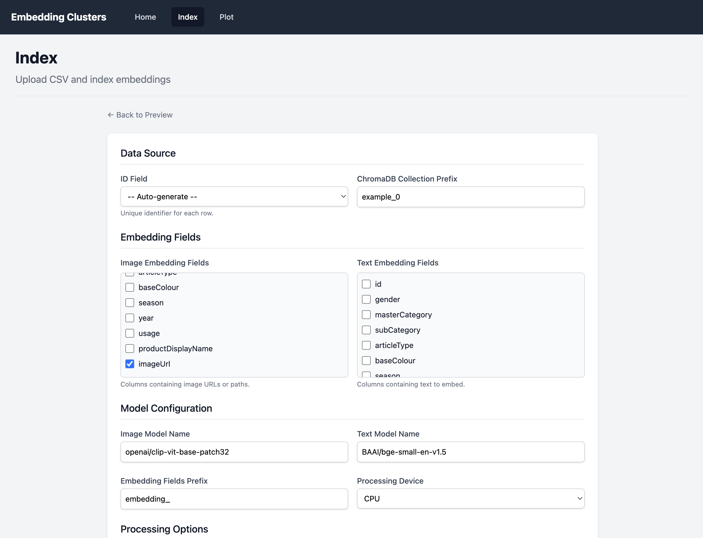
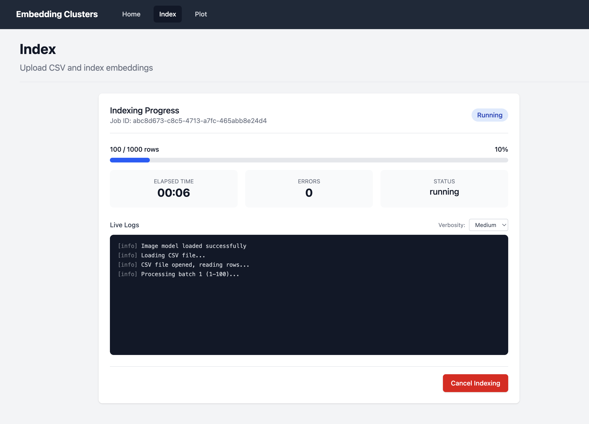

# embedding-clusters

[![python-version][python-badge]][python-url]
[![CI][ci-badge]][ci-url]
[![License: MIT][license-badge]][license-url]

Turn raw CSV data into beautiful, interactive 3D embedding clusters with
semantic search and a web UI.


## Quick Start

```bash
git clone https://github.com/aGallea/embedding-clusters.git
cd embedding-clusters
uv sync --all-extras
RUNNING_MODE=SERVER uv run python -m embedding_cluster
```

Open <http://localhost:8000>.

> Requires Python 3.13+ and [uv](https://docs.astral.sh/uv/).

## Features

- **Embeddings** — CLIP (images) + SentenceTransformer (text) with
  ChromaDB persistence
- **Clustering** — k-means with automatic cluster count suggestion
- **3D Visualization** — interactive scatter plot with t-SNE, UMAP, or PCA
  reduction and multiple render modes (particles, sprites, instanced spheres)
- **Semantic Search** — find similar items by text or image URL, highlighted
  directly in the 3D view
- **Cluster Drill-Down** — inspect cluster items, sub-cluster within a
  cluster, and explore hierarchical structure
- **AI-Powered Naming** — auto-label clusters using OpenAI, Google,
  Anthropic, or Ollama via LiteLLM
- **Annotations** — rename, tag, and annotate clusters with persistent
  notes
- **Web UI** — CSV upload, live indexing progress via WebSocket, plot
  controls, and collection management

## Screenshots


| | |
|---|---|
|  |  |
|  |  |

## How It Works

```text
CSV → Select Fields → Download Model → Embed & Store
  → Configure Plot → 3D Visualization → Search & Explore
```

1. **Upload CSV** — drag-and-drop in the web UI or pass a file path via CLI
2. **Select fields** — choose text columns (SentenceTransformer) and/or
   image URL columns (CLIP) to embed
3. **Embed & store** — rows are converted to vector embeddings and stored in
   a ChromaDB collection
4. **Plot** — pick a collection, set cluster count (or auto-suggest), choose
   a reduction algorithm, and render an interactive 3D scatter plot
5. **Search** — enter a text query or image URL to find and highlight the
   most similar items
6. **Drill down** — click a cluster to inspect items, sub-cluster for
   hierarchical exploration, and annotate with AI-generated or custom names

For detailed usage of all three modes (SERVER, INDEX, PLOT), environment
variables, and API endpoints, see [docs/USAGE.md](docs/USAGE.md).

## Architecture

The application has three running modes controlled by the `RUNNING_MODE`
environment variable:

- **SERVER** — FastAPI backend + React SPA (the web UI)
- **INDEX** — CLI-only CSV embedding pipeline
- **PLOT** — CLI-only cluster visualization

See [docs/ARCHITECTURE.md](docs/ARCHITECTURE.md) for the full system design,
data flow diagrams, and component breakdown.

## Development

```bash
uv sync --all-extras                           # Install dependencies
uv run ruff check embedding_cluster/ tests/    # Lint
uv run ruff format embedding_cluster/ tests/   # Format
uv run mypy embedding_cluster/                 # Type check (strict)
uv run pytest                                  # Run tests
```

Frontend (React 19 + TypeScript + Vite + Tailwind CSS 4):

```bash
cd frontend && npm install && npm run dev      # Dev server on :5173
cd frontend && npm run build                   # Production build
cd frontend && npm run test:e2e                # Playwright E2E tests
```

See [CONTRIBUTING.md](CONTRIBUTING.md) for the full development guide.

## Tech Stack

| Layer | Technology |
|-------|-----------|
| Backend | Python 3.13, FastAPI, Pydantic |
| Embeddings | SentenceTransformers, CLIP (HuggingFace) |
| Vector DB | ChromaDB |
| ML | scikit-learn (KMeans, t-SNE, PCA), UMAP |
| AI Naming | LiteLLM (OpenAI, Google, Anthropic, Ollama) |
| Frontend | React 19, TypeScript, Vite, Tailwind CSS 4 |
| 3D | React Three Fiber, Three.js, drei |
| State | Zustand, TanStack React Query |
| Testing | pytest, Playwright |
| CI | GitHub Actions (lint, typecheck, test with 90% coverage) |

## Contributing

See [CONTRIBUTING.md](CONTRIBUTING.md) for setup, code style, and PR
guidelines.

## License

[MIT](LICENSE)

<!-- MARKDOWN LINKS & IMAGES -->
[python-badge]: https://img.shields.io/badge/python-3.13-blue.svg
[python-url]: https://www.python.org/downloads/
[ci-badge]: https://github.com/aGallea/embedding-clusters/actions/workflows/ci.yml/badge.svg
[ci-url]: https://github.com/aGallea/embedding-clusters/actions/workflows/ci.yml
[license-badge]: https://img.shields.io/badge/License-MIT-green.svg
[license-url]: LICENSE
